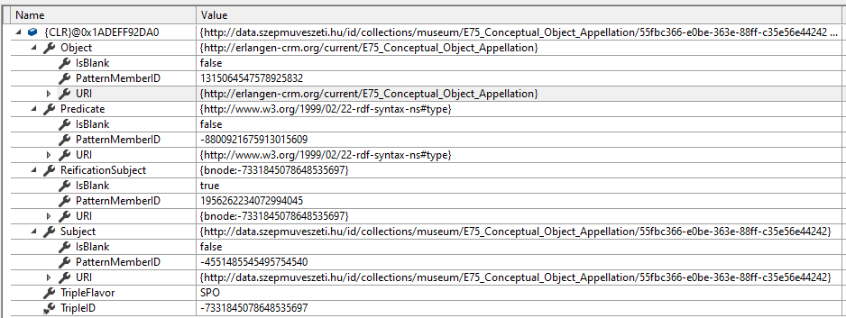
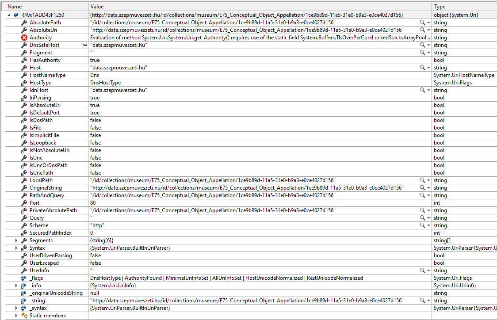

# Nem funkcionális jellemzők vizsgálata

## Eszközök és módszerek
A visual studio fejlesztői környezet beépített profiling és teljesítmény tesztelő eszközökkel rendelkezik. Ezeket ismertem meg közelebbről és vizsgálódásaim során többnyire ezekre az eszközökre támaszkodtam.

## Memóriahasználat
Egy in-memory triple store számára fontos a memória hatékony kihasználása, így minél nagyobb tárolókapacitás érhető el. Duplikált adatok a tárkapacitás csökkenéséhez vezetnek és foglalják az elérhető memória sávszélességet, ezáltal befolyásolva a lekérdezések teljesítményét is.

Háttértárra alapúló DBMS megoldások kevésbé limitáltak méretben, lekérdezések viszont elfogadhatatlanul lassúvá válhatnak interaktív alkalmazások számára.

 ### Turtle fájl deszerializálása
A program struktúrájából is megjósolható, hogy a nagy számban használt RDFTRiple, RDFResouce és System.URI objektumok lesznek felelősek az elfoglalt memória jelentős részéért. Meglepő viszont, hogy a 32 MB méretű turtle fájl (amelynek nagy részét ismétlődő uri prefix sztringek teszik ki) deszerializációja után az RDFGraph objektum 405 MB inkluzív mérettel rendelkezik. A teljes program memóriahasználata ~540MB.  

Jellemző tartalmazási lánc: TRiple > Resouce > Uri
 Osztály | Obj. szám | Összméret | Átlag méret
 -- | -- | -- |--
 RDFTriple | 331 925 | 323.5 MB | 974.68 bytes
 RDFResouce |  855 595 | 291.7 MB | 340.95 bytes
 System.Uri | 855 635 | 257.5 MB | 300.94 bytes

RDFSharp minden hármashoz eltárolja, többek között, a teljes névtérrel ellátott URI-okat vagy literálokat. A 32MB-os tesztfájl feldolgozása után ezek összesen 67 981 827 karaktert tesznek ki. Hármasonként átlagosan 204 karakter, UTF-16 kódolással (.NET ezt használja) 408 bájt adat, ami egy Triple 42%-át teszi csak ki.

RDFTRiple példa

System.Uri példa

Alternatív séma RDF hármasok tárolására URI duplikációk elkerülésével. A gyakori névtér prefixek is kiszervezhetőek külön relációba (az ábrán nem szerepel).
")

## Automatizált teljesítményteszt
A .NET frameworkhöz elérhető egy [Profiling API](https://docs.microsoft.com/en-us/dotnet/framework/unmanaged-api/profiling/), ami használható lehet arra, hogy automatikus teljesítményteszteket készítsünk és részletes információkat gyűjtsünk.

## Alkalmazás monitorozása üzemeltetés során
Rengeteg olyan rendszer jött létre, amelyek szerverek és alkalmazások metrikáit képesek rögzíteni. Ilyen például influxdata open source megoldása a TICK Stack (Telegraf, InfluxDB, Chronograf, Kapacitor), amely lehetőséget ad hardver és applikációk metrikáinak gyűjtésére, tárolására és alerting funkciók ellátására is.

Felhasznált irodalom:
- [Efficient RDF Storage and Retrieval in Jena2 (HP Laboratories)](https://www2.cs.uic.edu/~ifc/SWDB/papers/Wilkinson_etal.pdf)
- [A survey of RDF storage approaches (David C. Faye, Olivier Curé, Guillaume Blin)](https://hal.inria.fr/hal-01299496/document)
- [Measure app performance in Visual Studio](https://docs.microsoft.com/en-us/visualstudio/profiling/?view=vs-2019)
- [RDFSharp: RDF/SPARQL/SHACL docs](https://github.com/mdesalvo/RDFSharp/releases/download/v2.22.0/RDFSharp-2.22.0.pdf)
- [RDFSharp: OWL/SKOS docs](https://github.com/mdesalvo/RDFSharp/releases/download/v2.22.0/RDFSharp.Semantics-2.22.0.pdf)
