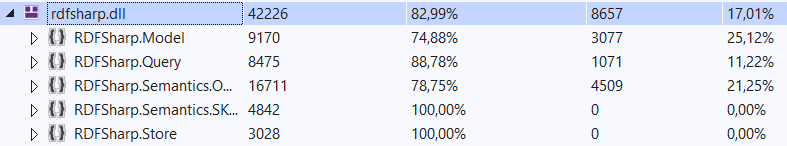

# Egységtesztek készítése és tesztek kódlefedettségének mérése

Felelősök:
- Benke Miklós (MexPain)
- Szőke Balázs (BACHlazs)

A kiindulási projekt egyáltalán nem tartalmazott egységteszteket, ami egy API esetében komoly hiányosság. Ezt igyekeztünk orvosolni minél több egységteszt bevezetésével. A feladat határidejéhez mérten a teljes API lefedésére nem volt lehetőségünk, mégis egy-egy komponensre szűkítés helyett azt a stratégiát választottuk, hogy igyekszünk az API leggyakoribb használata során elért funkciókat egy use-case alapú tesztelés irányából megközelíteni, és széles funkciópalettát tesztelni.Tesztelés során vegyesen alkalmaztuk a blackbox illetve whitebox teszttervezési megközelítést is.

Egy RDF-kezelő API-nak jellegéből adódóan kritikus része a modellekkel foglalkozó komponense, ezért a modell elemeket (RDF hármasok, gráfok) reprezentáló osztályokra külön figyelmet szenteltünk. A modell elemek konstruálásának helyességét és hibakezelését is teszteltük.

A SPARQL lekérdezésekkel foglalkozó komponenshez happy-path teszteket készítettünk, vizsgálva a query-konstruálás folyamatát, illetve a lekérdezés eredményének szabványos mivoltát.

**stb...**

Tesztekkel elért kódlefedettség:

(használt eszköz: Visual Studio Enterprise beépített kódlefedettség analizátora)

### Tanulságok:
A kódlefedettségi eredményekből is látható, mennyire nagyméretű teszthalmazra lenne szükség egy ilyen méretű API teszteléséhez. Ugyan egy kiadott API nem változik olyan dinamikusan, de a továbbfejlesztés és optimalilzálás szempontjából mindenképp érdemes lenne alapos tesztkészlettel támogatni a hibamentes működést, fejlesztést. API kiadásánál fokozottan fontos a tesztelés, így már a fejlesztés első pillanatától egységtesztekkel lett volna helyes kísérni a projektet. 
